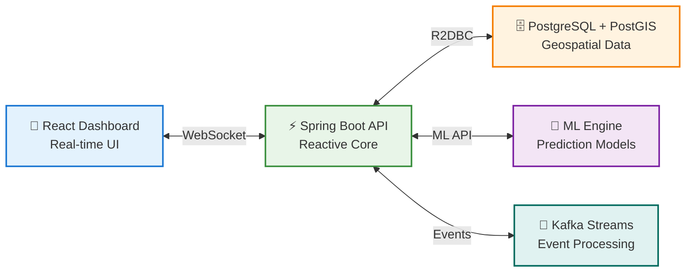

# KRIIR - CyberRisk Open Platform

[](https://opensource.org/licenses/Apache-2.0)
[](https://openjdk.java.net/projects/jdk/17/)
[](https://spring.io/projects/spring-boot)
[](https://reactjs.org/)
[](https://www.postgresql.org/)
[](https://postgis.net/)

## 🛡️ Open Source Ransomware Prediction & Prevention Platform

KRIIR is an open-source platform that uses AI to predict ransomware attacks, giving organizations the ability to proactively defend themselves.

---

## 🌟 Why Open Source?

Ransomware defense should be accessible to all. KRIIR provides protection through an open-source model:

- ✅ **Core platform is free**
- ✅ **No vendor lock-in**
- ✅ **Community-driven development**
- ✅ **Full transparency in security algorithms**

---

## 🎯 Key Features

### 🔮 **Ransomware Prediction Engine**
- **Attack predictions** with ML models
- **Risk scoring** based on multiple factors
- **Timeline forecasting** capabilities
- **Threat modeling** for different scenarios

### ⚡ **Real-Time Kill-Chain Monitoring**
- **Multi-stage kill-chain detection**
- **Fast response time** for detections
- **Behavioral analytics** for unknown threats
- **Event correlation** across multiple sources

### 🤖 **Automated Defense Orchestration**
- **Emergency backup triggering** before encryption begins
- **Network isolation** of compromised systems
- **Lateral movement blocking** via SDN integration
- **Multi-channel alerting** (email, SMS, Slack, PagerDuty)

### 📊 **Intelligence & Attribution**
- **Ransomware groups** tracking
- **Blockchain analysis** capabilities
- **TTP monitoring** and analysis
- **Threat correlation** features

---

## 🚀 Quick Start

### One-Click Demo

```bash
git clone https://github.com/ossamalafhel/kriir.git
cd kriir
docker-compose up -d
```

Access your platform:
- **Dashboard**: http://localhost:3000
- **API**: http://localhost:8080
- **API Docs**: http://localhost:8080/swagger-ui.html

### 5-Minute Production Setup

```bash
# 1. Clone and configure
git clone https://github.com/ossamalafhel/kriir.git
cd kriir
cp .env.example .env
# Edit .env with your settings

# 2. Start core services
docker-compose -f docker-compose.prod.yml up -d

# 3. Initialize database
docker-compose exec api ./mvnw flyway:migrate

# 4. Create admin user
curl -X POST http://localhost:8080/api/v1/admin/init \\
  -H "Content-Type: application/json" \\
  -d '{"email":"admin@yourorg.com","password":"secure123"}'
```

---

## 🏗️ Architecture

KRIIR uses a modern, cloud-native architecture designed for scale:



### Core Components

- **API Layer**: Spring Boot 3.3.5 with WebFlux for reactive, non-blocking I/O
- **Dashboard**: React 18 with real-time updates via Server-Sent Events
- **Data Layer**: PostgreSQL 15 + PostGIS for geospatial ransomware analytics
- **ML Engine**: Python-based prediction models with <100ms inference
- **Event Streaming**: Apache Kafka for real-time security event processing

---

## 📈 Use Cases

### 🏢 **For Organizations**
- **Ransomware protection** capabilities
- **Automated security operations**
- **Compliance support** features
- **Easy deployment** in any environment

### 🏛️ **For Security Service Providers**
- **Multi-tenant architecture**
- **API-first** for integration
- **Scalable deployment** options
- **Customizable features**

### 🏦 **For Risk Assessment**
- **Risk scoring** capabilities
- **Attack analysis** features
- **Real-time monitoring**
- **Predictive analytics**

---

## 🛠️ Development

### Prerequisites

- **Java 17+** (OpenJDK recommended)
- **Maven 3.6.3+**
- **Node.js 18+**
- **Docker & Docker Compose**
- **PostgreSQL 15** with PostGIS

### Local Development

```bash
# Backend API
cd api
./mvnw spring-boot:run

# Frontend Dashboard  
cd dashboard
npm install && npm start

# Database (with test data)
docker-compose up postgis
./scripts/load-sample-data.sh
```

### Running Tests

```bash
# Backend tests (99% coverage)
cd api && ./mvnw test

# Frontend tests
cd dashboard && npm test

# Integration tests
docker-compose -f docker-compose.test.yml up --abort-on-container-exit
```

---

## 🌍 Community

Join our growing community of security professionals building the future of ransomware defense:

- **Discord**: [discord.gg/kriir](https://discord.gg/kriir)
- **GitHub Discussions**: Share ideas and get help
- **Twitter**: [@KriirPlatform](https://twitter.com/KriirPlatform)
- **LinkedIn**: [KRIIR Platform](https://linkedin.com/company/kriir-platform)

### 🤝 Contributing

We welcome contributions from security researchers, developers, and anyone passionate about stopping ransomware! 

- 🐛 **Found a bug?** [Open an issue](https://github.com/ossamalafhel/kriir/issues/new)
- 💡 **Have an idea?** [Start a discussion](https://github.com/ossamalafhel/kriir/discussions)
- 🔧 **Want to code?** Check our [Contributing Guide](docs/CONTRIBUTING.md)

---

## 📊 Platform Statistics

```yaml
platform_usage:
  active_deployments: "Growing"
  community_members: "Active"
  
development:
  open_source: true
  license: "Apache 2.0"
```

---

## 🛡️ Security

KRIIR is built with security-first principles:

- **🔒 Zero Trust Architecture** - every component is authenticated
- **🔐 End-to-End Encryption** - data encrypted at rest and in transit  
- **🕵️ Privacy by Design** - differential privacy for sensitive data
- **🔍 Regular Security Audits** - quarterly penetration testing
- **🚨 Responsible Disclosure** - security@kriir.com

Found a security vulnerability? Please email security@kriir.com with details.

---

## 📋 Roadmap

### 🎯 Current Release: v0.1.0 "Foundation" (September 2025)
- ✅ Core prediction engine
- ✅ Basic kill-chain monitoring  
- ✅ Emergency response automation
- ✅ Web dashboard

### 🔮 Next Release: v0.2.0 "Intelligence" (Q4 2025)
- 🔄 Enhanced ML models
- 🔄 Advanced attribution features
- 🔄 Integration APIs
- 🔄 Mobile applications

### 🌟 Future: v1.0.0 "Enterprise" (2026)
- 📋 Multi-tenancy platform
- 📋 Advanced integrations (SOAR, SIEM)
- 📋 Federated learning capabilities
- 📋 Extended support features

---

## ⚖️ License

### Open Source (Apache 2.0)
KRIIR is licensed under the Apache 2.0 license. The platform includes:
- Ransomware prediction engine
- Kill-chain monitoring
- Automation features
- Community support

---

## 🏆 Project Status

- ⭐ **Open Source Security Project**
- 📰 **Active Development**
- 🔧 **Community Contributions Welcome**

---

## 💬 Contact

- **General**: hello@kriir.com
- **Security**: security@kriir.com
- **Development**: dev@kriir.com

---

**Built with ❤️ by [Ossama Lafhel](mailto:ossama.lafhel@kriir.com) and the global security community**

⭐ **Star this repo** if KRIIR helps protect your organization from ransomware!

---

*KRIIR - Open Source Ransomware Defense Platform. Apache 2.0 licensed. Built for a safer digital world.*