# COP - CyberRisk Open Platform

[](https://opensource.org/licenses/MIT)
[](https://openjdk.java.net/projects/jdk/17/)
[](https://spring.io/projects/spring-boot)
[](https://reactjs.org/)
[](https://www.postgresql.org/)
[](https://postgis.net/)

## 🛡️ Open-Source Geospatial Security Intelligence Platform

COP is a modern, reactive platform designed for cyber risk management and security incident monitoring with advanced geospatial analytics capabilities.

### 🌟 Key Features

- **🏗️ Reactive Architecture**: Built with Spring WebFlux for high-performance, non-blocking operations
- **🗺️ Geospatial Intelligence**: IT asset tracking and incident mapping with PostGIS
- **🚨 Real-time Monitoring**: Security incident detection and alerting via Server-Sent Events
- **📊 Risk Analytics**: Spatial correlation analysis and threat pattern recognition
- **🔄 Event-Driven**: PostgreSQL LISTEN/NOTIFY for instant data synchronization
- **🐳 Production Ready**: Docker containerization with comprehensive health checks

## 🚀 Quick Start

### Prerequisites

- Java 17+
- Docker & Docker Compose
- Node.js 18+
- PostgreSQL 15 with PostGIS (or use Docker)

### 🐳 Docker Deployment (Recommended)

```bash
# Clone the repository
git clone https://github.com/ossamalafhel/reactive-transactional.git
cd reactive-transactional

# Start the platform
docker-compose up -d

# Access the application
# Frontend: http://localhost:3000
# Backend API: http://localhost:8080
# API Docs: http://localhost:8080/swagger-ui.html
```

### 💻 Local Development

```bash
# Backend
cd server
./mvnw spring-boot:run

# Frontend
cd front
npm install
npm start
```

## 🏗️ Architecture

COP follows a reactive, event-driven architecture optimized for real-time security monitoring:

```mermaid
graph LR
    A[React 18 Frontend<br/>• Asset Maps<br/>• Incident Dashboard<br/>• Risk Analytics] 
    B[Spring Boot 3 WebFlux<br/>• R2DBC<br/>• Reactive<br/>• REST APIs]
    C[PostgreSQL + PostGIS<br/>• Geospatial<br/>• Real-time<br/>• Notifications]
    
    A -.->|SSE| B
    A <-->|HTTP/WebSocket| B
    B <-->|R2DBC| C
    
    style A fill:#e3f2fd,stroke:#1976d2,stroke-width:2px
    style B fill:#e8f5e8,stroke:#388e3c,stroke-width:2px  
    style C fill:#fff3e0,stroke:#f57c00,stroke-width:2px
```



## 📊 Core Entities

### IT Assets
- Infrastructure components with geolocation
- Criticality levels (LOW/MEDIUM/HIGH/CRITICAL)
- Real-time health monitoring
- Types: Servers, Workstations, Network devices, IoT, Cloud instances

### Security Incidents
- Geospatially-aware incident tracking
- Severity classification
- Incident lifecycle management
- Correlation with affected assets

## 🔧 API Endpoints

| Method | Endpoint | Description |
|--------|----------|-------------|
| GET | `/assets` | List all IT assets |
| POST | `/assets` | Register new asset |
| GET | `/assets/stream` | Real-time asset updates (SSE) |
| GET | `/assets/nearby` | Find assets within radius |
| GET | `/incidents` | List security incidents |
| POST | `/incidents` | Report new incident |
| GET | `/incidents/stream` | Real-time incident alerts (SSE) |
| PATCH | `/incidents/{id}/status` | Update incident status |

## 🗺️ Geospatial Capabilities

- **Asset Proximity Analysis**: Find assets within specified radius
- **Incident Hotspot Detection**: Identify geographic clusters of incidents
- **Risk Zone Mapping**: Visualize high-risk areas
- **Spatial Correlation**: Link incidents to nearby assets
- **Real-time Tracking**: Live updates on asset/incident locations

## 🐳 Docker Configuration

```yaml
services:
  postgis:
    image: postgis/postgis:15-3.4-alpine
    environment:
      POSTGRES_DB: cop_db
      POSTGRES_USER: cop
      POSTGRES_PASSWORD: cop
    volumes:
      - postgres_data:/var/lib/postgresql/data
    
  backend:
    build: ./server
    depends_on:
      - postgis
    environment:
      SPRING_PROFILES_ACTIVE: prod
    
  frontend:
    build: ./front
    depends_on:
      - backend
```

## 🔒 Security & Compliance

- Container security with non-root users
- Environment-based configuration
- CORS protection
- Input validation and sanitization
- Prepared statements for SQL injection prevention

## 📈 Monitoring & Observability

- Spring Boot Actuator health endpoints
- Prometheus metrics export ready
- Structured JSON logging
- Performance metrics tracking
- Container health checks

## 🤝 Contributing

We welcome contributions! Please see our [Contributing Guide](docs/CONTRIBUTING.md) for details.

## 📝 License

This project is licensed under the MIT License - see the [LICENSE](LICENSE) file for details.

## 🙏 Acknowledgments

Built by **Ossama Lafhel** - [ossama.lafhel@kanpredict.com](mailto:ossama.lafhel@kanpredict.com)

---

**COP - CyberRisk Open Platform**: Empowering organizations with open-source geospatial security intelligence.