# KRIIR API - Cyber Risk Platform 🛡️

Open-source ransomware prediction and prevention platform API.

---

## 🚀 Quick Start

### Prerequisites

- **Java 17** or higher
- **Maven 3.6.3** or higher  
- **Docker** for PostgreSQL database
- **Node.js 18+** for dashboard (optional)

### Database Setup

Launch PostgreSQL with PostGIS extension:

```bash
cd api
docker run --name kriir-db -p 5432:5432 \
  -e "POSTGRES_USER=kriir" \
  -e "POSTGRES_PASSWORD=kriir" \
  -e "POSTGRES_DB=kriir_db" \
  -d postgis/postgis:15-3.4
```

### Build & Run

```bash
# Build the application
mvn clean install

# Run the API in development mode
mvn quarkus:dev

# Or build and run the JAR
mvn clean package
java -jar target/quarkus-app/quarkus-run.jar
```

### Access Points

- **API Documentation:** [http://localhost:8080/swagger-ui.html](http://localhost:8080/swagger-ui.html)
- **Health Check:** [http://localhost:8080/actuator/health](http://localhost:8080/actuator/health)
- **Metrics:** [http://localhost:8080/actuator/metrics](http://localhost:8080/actuator/metrics)

---

## 🎯 Core Features

### Ransomware Prediction Engine
- Predictive models for 48-72 hour attack forecasting
- Risk scoring based on organizational attributes and threat landscape
- Continuous analysis of threat indicators and patterns

### Kill-Chain Monitoring
- Detection of ransomware attack progression through multiple stages
- Automated response mechanisms for attack interruption
- Event-driven architecture for rapid incident response

### Automated Defense Systems
- **Emergency backup triggering** before encryption begins
- Network isolation and lateral movement blocking
- Critical alert orchestration across multiple channels

### Intelligence & Attribution
- Ransomware group tracking and TTP analysis
- Economic impact modeling and payment tracking
- Insurance risk scoring and underwriting support

---

## 🏗️ Architecture

### Technology Stack
- **Backend:** Quarkus 3.15.1 with Reactive Programming
- **Database:** PostgreSQL 15 + PostGIS 3.4 for geospatial data
- **Data Access:** Hibernate Reactive with Panache for reactive database operations
- **ML Models:** Prediction models with causal inference algorithms
- **Real-time:** Server-Sent Events (SSE) for live updates
- **API:** RESTful APIs + GraphQL + WebSocket support

### Key Components

```mermaid
graph TD
    A[🎯 Ransomware Prediction Engine] --> F[KRIIR Platform Architecture]
    B[⚡ Real-time Kill-Chain Monitor] --> F
    C[🛡️ Automated Defense Orchestrator] --> F
    D[🔍 Threat Intelligence Processor] --> F
    E[📊 Risk Analytics & Scoring] --> F
    G[🔗 Insurance Integration APIs] --> F
    
    style F fill:#e1f5fe,stroke:#01579b,stroke-width:2px
    style A fill:#fff3e0,stroke:#f57c00,stroke-width:2px
    style B fill:#e8f5e8,stroke:#388e3c,stroke-width:2px
    style C fill:#fce4ec,stroke:#c2185b,stroke-width:2px
    style D fill:#f3e5f5,stroke:#7b1fa2,stroke-width:2px
    style E fill:#fff8e1,stroke:#f9a825,stroke-width:2px
    style G fill:#e0f2f1,stroke:#00695c,stroke-width:2px
```



---

## 📊 API Overview

### Core Endpoints

#### Ransomware Risk Prediction
```bash
POST /api/v1/predictions/ransomware-risk
{
  "organization": {
    "name": "Acme Corp",
    "industry": "manufacturing", 
    "size": "enterprise",
    "location": {"latitude": 40.7128, "longitude": -74.0060}
  },
  "timeHorizon": "PT72H"
}
```

#### Real-time Threat Monitoring  
```bash
GET /api/v1/threats/ransomware/live
WebSocket: /ws/v1/ransomware-alerts
```

#### Asset & Security Incident Management
```bash
GET    /api/v1/assets              # List all IT assets
POST   /api/v1/assets              # Create new asset
PUT    /api/v1/assets/{id}         # Update asset
DELETE /api/v1/assets/{id}         # Delete asset

GET    /api/v1/security-incidents  # List security incidents  
POST   /api/v1/security-incidents  # Report new incident
```

---

## 🧪 Testing

### Run Tests
```bash
# Run all tests
mvn test

# Run with coverage report  
mvn clean test jacoco:report

# View coverage report
open target/site/jacoco/index.html
```

### Test Coverage
- **Current Coverage:** 99%+ (targeting 100%)
- **Unit Tests:** Comprehensive service and controller tests
- **Integration Tests:** End-to-end API testing
- **Performance Tests:** Load testing for high-throughput scenarios

---

## 🔒 Security

### Authentication & Authorization
- **OAuth 2.0 + OIDC** integration
- **JWT-based** API authentication
- **Role-based access control** (RBAC)
- **Fine-grained permissions** for geographic data access

### Data Protection
- **Encryption at rest:** AES-256
- **Encryption in transit:** TLS 1.3
- **Privacy-by-design** with differential privacy
- **GDPR/CCPA compliance** built-in

### Security Monitoring
- **Real-time threat detection** 
- **Automated incident response**
- **Comprehensive audit logging**
- **Vulnerability scanning** integration

---

## 🚀 Deployment

### Docker Deployment
```bash
# Build container
docker build -t kriir-platform .

# Run with compose
docker-compose up -d
```

### Kubernetes Deployment
```bash
# Apply manifests
kubectl apply -f k8s/

# Check deployment
kubectl get pods -n kriir-platform
```

### Production Configuration
- **Multi-region deployment** for high availability
- **Auto-scaling** based on load and threat activity
- **Monitoring** with Prometheus + Grafana
- **Logging** with ELK stack integration

---

## 📈 Monitoring & Metrics

### Key Performance Indicators
- **Prediction Window:** 48-72 hours ahead
- **Model Performance:** Continuously evaluated and improved
- **Response Latency:** Optimized for sub-minute detection
- **System Throughput:** Designed for high-volume processing
- **Data Processing:** Real-time streaming architecture

### Operational Metrics
- API response times (<500ms 95th percentile)
- System uptime (99.9% target)
- Data pipeline latency (<30 seconds)
- Concurrent user capacity (10,000+)

---

## 🤝 Contributing

We welcome contributions to the KRIIR platform!

### Development Setup
1. Fork the repository
2. Create a feature branch
3. Make your changes with tests
4. Ensure 100% test coverage
5. Submit a pull request

### Code Quality Standards
- **Test Coverage:** 100% (enforced by JaCoCo)
- **Code Style:** Follow existing patterns
- **Security:** No secrets in code
- **Documentation:** Update for new features

---

## 📚 Documentation

- **[API Reference](http://localhost:8080/swagger-ui.html)** - Interactive API documentation

---

## 🎯 Roadmap

### Phase 1: Core Platform (Completed - March 2025)
- ✅ Ransomware prediction models implementation
- ✅ Kill-chain monitoring and detection systems
- ✅ Automated response framework
- ✅ Real-time data processing pipeline

### Phase 2: Enhanced Capabilities (April - September 2025)
- 🔄 Attribution and analysis engines
- 🔄 Risk modeling components
- 🔄 External system integration APIs
- 🔄 Cross-platform client support

### Phase 3: Advanced Features (October 2025+)
- 📋 Distributed learning architectures
- 📋 Enhanced cryptographic implementations
- 📋 Federated intelligence sharing
- 📋 Extended platform capabilities

---

## ⚖️ License

This project is licensed under the **Apache License 2.0** - see the [LICENSE](LICENSE) file for details.

### Usage Rights
- Open source under Apache License 2.0
- Modification and distribution permitted
- Patent rights included as per Apache 2.0 terms
- Attribution required

---

## 📝 Author

**Developed by Ossama Lafhel**  
📧 [ossama.lafhel@kanpredict.com](mailto:ossama.lafhel@kanpredict.com)

### Technical Foundation
- Machine Learning prediction models
- Geospatial data processing with PostGIS
- Reactive programming with Quarkus
- Event-driven architecture
- Security-focused design patterns

---

*Open-source ransomware prediction and prevention platform.*

**⭐ Star this repository if you find this project useful!**