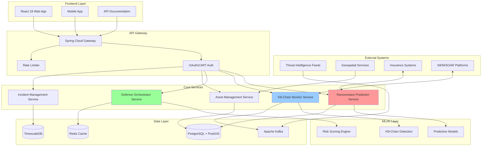
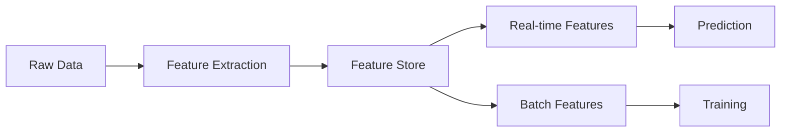
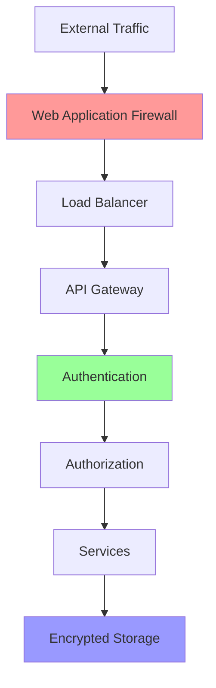
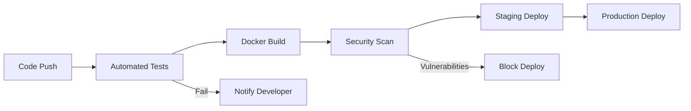

# Architecture Documentation - COP Platform

## Overview

COP (CyberRisk Open Platform) is a reactive, event-driven platform designed for real-time ransomware prediction and prevention. The architecture leverages modern reactive programming patterns, geospatial intelligence, and machine learning to provide enterprise-grade cyber defense capabilities.

## High-Level Architecture



## Core Components

### 1. Frontend Layer

#### React 18 Web Application
- **Technology**: React 18 with TypeScript
- **State Management**: Redux Toolkit with RTK Query
- **UI Framework**: Material-UI v5
- **Mapping**: Mapbox GL JS for geospatial visualization
- **Real-time**: Server-Sent Events for live updates
- **Key Features**:
  - Interactive ransomware risk dashboard
  - Real-time kill-chain visualization
  - Asset mapping and management
  - Incident response interface

#### Mobile Application (Future)
- **Technology**: React Native
- **Features**: Push notifications for critical alerts
- **Offline**: Local caching for essential data

### 2. API Gateway Layer

#### Spring Cloud Gateway
- **Purpose**: Single entry point for all API requests
- **Features**:
  - Request routing and load balancing
  - API versioning
  - Request/Response transformation
  - Circuit breaker pattern

#### Authentication & Authorization
- **OAuth 2.0**: External identity providers
- **JWT**: Stateless authentication
- **RBAC**: Role-based access control
- **MFA**: Multi-factor authentication support

#### Rate Limiting
- **Redis-backed**: Distributed rate limiting
- **Strategies**: Per-user, per-IP, per-endpoint
- **DDoS Protection**: Automatic blocking of suspicious patterns

### 3. Core Services (Microservices)

#### Ransomware Prediction Service
```java
@RestController
@RequestMapping("/api/v1/predictions")
public class RansomwarePredictionController {
    // Handles ransomware risk predictions
    // Integrates with ML models
    // Provides real-time risk scoring
}
```

**Responsibilities**:
- Organization risk profiling
- Attack timeline prediction
- Vulnerability assessment
- Risk score calculation

**Key APIs**:
- `POST /ransomware-risk`: Predict attack probability
- `GET /risk-factors`: Get contributing risk factors
- `POST /batch-assessment`: Bulk risk assessment

#### Kill-Chain Monitor Service
```java
@Service
public class KillChainMonitorService {
    // Real-time monitoring of attack progression
    // Pattern detection across kill-chain stages
    // Automated alert generation
}
```

**Responsibilities**:
- Real-time event correlation
- Kill-chain stage detection
- Attack progression tracking
- Alert prioritization

**Event Processing**:
- Consumes security events from Kafka
- Applies ML models for stage detection
- Publishes alerts via SSE

#### Defense Orchestrator Service
```java
@Service
public class DefenseOrchestratorService {
    // Automated response coordination
    // Integration with security tools
    // Backup and isolation management
}
```

**Responsibilities**:
- Emergency response automation
- Network isolation orchestration
- Backup triggering
- Multi-channel alerting

**Integration Points**:
- Backup systems
- Network security controls
- Communication platforms
- SOAR platforms

#### Asset Management Service
- **Purpose**: IT asset inventory and risk tracking
- **Geospatial**: PostGIS for location-based queries
- **Features**:
  - Asset registration and tracking
  - Criticality classification
  - Vulnerability correlation
  - Proximity analysis

#### Incident Management Service
- **Purpose**: Security incident lifecycle management
- **Time-series**: TimescaleDB for incident analytics
- **Features**:
  - Incident reporting
  - Investigation tracking
  - Impact assessment
  - Post-incident analysis

### 4. Data Architecture

#### Primary Database: PostgreSQL + PostGIS
```sql
-- Core tables with geospatial support
CREATE TABLE assets (
    id UUID PRIMARY KEY,
    name VARCHAR(255) NOT NULL,
    type VARCHAR(50),
    criticality VARCHAR(20),
    location GEOMETRY(POINT, 4326),
    risk_score DECIMAL(3,1),
    created_at TIMESTAMPTZ DEFAULT NOW()
);

CREATE INDEX idx_assets_location ON assets USING GIST(location);
```

**Usage**:
- Asset and incident storage
- Geospatial queries
- ACID compliance for critical data

#### Cache Layer: Redis
- **Purpose**: High-speed caching and session storage
- **Use Cases**:
  - API response caching
  - Rate limiting counters
  - Real-time risk scores
  - WebSocket session management

#### Message Queue: Apache Kafka
```yaml
topics:
  - threat-intelligence-feed
  - security-events
  - kill-chain-alerts
  - defense-actions
```

**Purpose**:
- Event streaming
- Service decoupling
- Reliable message delivery
- Event sourcing

#### Time-Series: TimescaleDB
- **Purpose**: Efficient storage of time-series data
- **Use Cases**:
  - Incident timelines
  - Risk score history
  - Attack pattern analysis
  - Performance metrics

### 5. ML/AI Architecture

#### Model Deployment
```python
# Model serving architecture
class ModelServingPipeline:
    def __init__(self):
        self.models = {
            'ransomware_predictor': RansomwarePredictionModel(),
            'kill_chain_detector': KillChainDetectionModel(),
            'risk_scorer': RiskScoringModel()
        }
    
    def predict(self, model_name, features):
        return self.models[model_name].predict(features)
```

**Infrastructure**:
- Model versioning with MLflow
- A/B testing framework
- Real-time inference (<100ms)
- GPU acceleration for complex models

#### Feature Engineering Pipeline


### 6. Security Architecture

#### Defense in Depth


**Security Layers**:
1. **Network Security**: Firewall, DDoS protection
2. **Application Security**: Input validation, OWASP compliance
3. **Data Security**: Encryption at rest and in transit
4. **Access Control**: RBAC, API key management
5. **Monitoring**: Security event logging, anomaly detection

### 7. Deployment Architecture

#### Container Orchestration (Kubernetes)
```yaml
apiVersion: apps/v1
kind: Deployment
metadata:
  name: ransomware-prediction-service
spec:
  replicas: 3
  template:
    spec:
      containers:
      - name: prediction-service
        image: cop/prediction-service:latest
        resources:
          requests:
            memory: "2Gi"
            cpu: "1"
          limits:
            memory: "4Gi"
            cpu: "2"
```

**Deployment Strategy**:
- Blue-green deployments
- Automatic scaling based on load
- Health checks and readiness probes
- Resource isolation

#### CI/CD Pipeline


### 8. Monitoring and Observability

#### Metrics Collection
- **Prometheus**: Service metrics
- **Grafana**: Visualization dashboards
- **Custom Metrics**:
  - Prediction accuracy
  - Response times
  - Attack detection rate
  - False positive rate

#### Distributed Tracing
- **OpenTelemetry**: End-to-end request tracing
- **Jaeger**: Trace visualization
- **Performance Analysis**: Bottleneck identification

#### Logging Architecture
```yaml
logging:
  - application: Structured JSON logs
  - security: Separate security event logs
  - audit: Immutable audit trail
  - aggregation: ELK Stack (Elasticsearch, Logstash, Kibana)
```

### 9. Performance Optimization

#### Reactive Programming
```java
@Service
public class ReactiveAssetService {
    public Flux<Asset> streamNearbyAssets(Point location, double radius) {
        return assetRepository
            .findWithinRadius(location, radius)
            .filter(asset -> asset.getStatus() == Status.ACTIVE)
            .map(this::enrichWithRiskScore)
            .subscribeOn(Schedulers.parallel());
    }
}
```

**Benefits**:
- Non-blocking I/O
- Efficient resource utilization
- Backpressure handling
- Stream processing

#### Caching Strategy
- **L1 Cache**: Application-level (Caffeine)
- **L2 Cache**: Distributed (Redis)
- **CDN**: Static asset caching
- **Database**: Query result caching

### 10. Scalability Considerations

#### Horizontal Scaling
- Stateless services
- Database read replicas
- Distributed caching
- Load balancing

#### Data Partitioning
- Time-based partitioning for incidents
- Geographic sharding for assets
- Hash-based partitioning for events

#### Performance Targets
- **API Response**: <500ms (95th percentile)
- **Prediction Latency**: <100ms
- **Concurrent Users**: 10,000+
- **Events/Second**: 100,000+

## Technology Stack Summary

| Layer | Technology | Purpose |
|-------|------------|---------|
| Frontend | React 18 | Web UI |
| Backend | Spring Boot 3.3.5 | REST APIs |
| Reactive | Spring WebFlux | Non-blocking I/O |
| Database | PostgreSQL 15 + PostGIS | Spatial data |
| Cache | Redis | Fast data access |
| Streaming | Apache Kafka | Event processing |
| ML/AI | Python + PyTorch | Prediction models |
| Container | Docker | Packaging |
| Orchestration | Kubernetes | Deployment |
| Monitoring | Prometheus + Grafana | Observability |
| Security | OAuth2 + JWT | Authentication |

## Future Architecture Considerations

### 1. Federated Learning
- Privacy-preserving ML across organizations
- Decentralized model training
- Secure aggregation protocols

### 2. Edge Computing
- Local inference for critical decisions
- Reduced latency for real-time response
- Offline capability

### 3. Quantum-Resistant Cryptography
- Post-quantum encryption algorithms
- Future-proof security measures
- Gradual migration strategy

### 4. Multi-Cloud Strategy
- Avoid vendor lock-in
- Geographic distribution
- Disaster recovery

---

## Contributors

This is an open-source project maintained by the community. For contributions, please see CONTRIBUTING.md.