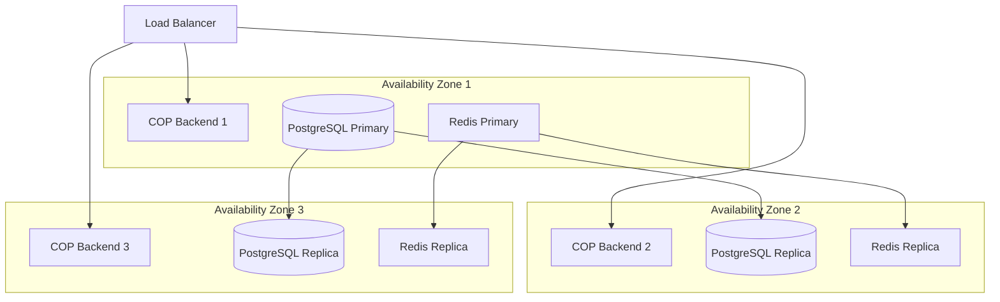
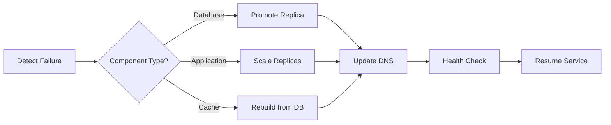

# Deployment Guide - COP Platform

This guide covers deployment strategies for the COP (CyberRisk Open Platform) ransomware defense system across different environments.

## Table of Contents

1. [Prerequisites](#prerequisites)
2. [Environment Configuration](#environment-configuration)
3. [Docker Deployment](#docker-deployment)
4. [Kubernetes Deployment](#kubernetes-deployment)
5. [Production Best Practices](#production-best-practices)
6. [Security Hardening](#security-hardening)
7. [Monitoring and Alerting](#monitoring-and-alerting)
8. [Disaster Recovery](#disaster-recovery)

## Prerequisites

### System Requirements

#### Minimum (Development)
- **Docker**: 20.10+ with Docker Compose 2.0+
- **Memory**: 8GB RAM
- **CPU**: 4 cores
- **Storage**: 50GB SSD
- **Network**: Ports 3000, 8080, 5432, 6379 available

#### Recommended (Production)
- **Container Orchestration**: Kubernetes 1.25+
- **Memory**: 32GB+ RAM per node
- **CPU**: 8+ cores per node
- **Storage**: 500GB+ NVMe SSD
- **Network**: 10Gbps+ network connectivity

### Software Dependencies
- **Java**: OpenJDK 17+
- **Node.js**: 18+ (for frontend builds)
- **PostgreSQL**: 15 with PostGIS 3.4
- **Redis**: 7.0+
- **Apache Kafka**: 3.5+ (for event streaming)

## Environment Configuration

### Environment Variables

```bash
# Application Configuration
COP_ENV=production
COP_VERSION=2.0.0

# Database Configuration
POSTGRES_HOST=localhost
POSTGRES_PORT=5432
POSTGRES_DB=cop_db
POSTGRES_USER=cop
POSTGRES_PASSWORD=<secure_password>

# Redis Configuration
REDIS_HOST=localhost
REDIS_PORT=6379
REDIS_PASSWORD=<secure_password>

# Kafka Configuration
KAFKA_BOOTSTRAP_SERVERS=localhost:9092
KAFKA_SECURITY_PROTOCOL=SASL_SSL

# Security Configuration
JWT_SECRET=<256-bit-secret>
ENCRYPTION_KEY=<aes-256-key>
OAUTH_CLIENT_ID=<oauth-client-id>
OAUTH_CLIENT_SECRET=<oauth-client-secret>

# ML Model Configuration
ML_MODEL_PATH=/models
ML_INFERENCE_TIMEOUT=1000
ML_GPU_ENABLED=true

# Monitoring
MONITORING_ENABLED=true
METRICS_PORT=9090
TRACING_ENABLED=true
```

### Configuration Files

#### application-prod.yml
```yaml
spring:
  profiles:
    active: prod
  
  r2dbc:
    url: r2dbc:postgresql://${POSTGRES_HOST}:${POSTGRES_PORT}/${POSTGRES_DB}
    username: ${POSTGRES_USER}
    password: ${POSTGRES_PASSWORD}
    pool:
      enabled: true
      initial-size: 20
      max-size: 50
      
  redis:
    host: ${REDIS_HOST}
    port: ${REDIS_PORT}
    password: ${REDIS_PASSWORD}
    ssl: true
    
cop:
  security:
    ransomware-detection:
      enabled: true
      sensitivity: high
      auto-response: true
    
  ml:
    models:
      prediction: /models/ransomware_predictor_v2.pkl
      killchain: /models/killchain_detector_v2.pkl
    gpu:
      enabled: ${ML_GPU_ENABLED}
```

## Docker Deployment

### Development Environment

```bash
# Clone repository
git clone https://github.com/your-org/cop-platform.git
cd cop-platform

# Create environment file
cp .env.example .env
# Edit .env with your configuration

# Build and start services
docker-compose up --build
```

### Production Docker Compose

```yaml
version: '3.9'

services:
  postgres:
    image: postgis/postgis:15-3.4-alpine
    volumes:
      - postgres_data:/var/lib/postgresql/data
      - ./init-scripts:/docker-entrypoint-initdb.d
    environment:
      POSTGRES_DB: ${POSTGRES_DB}
      POSTGRES_USER: ${POSTGRES_USER}
      POSTGRES_PASSWORD: ${POSTGRES_PASSWORD}
    deploy:
      resources:
        limits:
          cpus: '2'
          memory: 4G
    healthcheck:
      test: ["CMD-SHELL", "pg_isready -U ${POSTGRES_USER}"]
      interval: 10s
      timeout: 5s
      retries: 5

  redis:
    image: redis:7-alpine
    command: >
      --requirepass ${REDIS_PASSWORD}
      --appendonly yes
      --appendfsync everysec
    volumes:
      - redis_data:/data
    deploy:
      resources:
        limits:
          cpus: '1'
          memory: 2G

  kafka:
    image: confluentinc/cp-kafka:7.5.0
    depends_on:
      - zookeeper
    environment:
      KAFKA_BROKER_ID: 1
      KAFKA_ZOOKEEPER_CONNECT: zookeeper:2181
      KAFKA_ADVERTISED_LISTENERS: PLAINTEXT://kafka:29092,EXTERNAL://localhost:9092
      KAFKA_LISTENER_SECURITY_PROTOCOL_MAP: PLAINTEXT:PLAINTEXT,EXTERNAL:PLAINTEXT
      KAFKA_INTER_BROKER_LISTENER_NAME: PLAINTEXT
      KAFKA_AUTO_CREATE_TOPICS_ENABLE: "false"
      KAFKA_LOG_RETENTION_HOURS: 168
    volumes:
      - kafka_data:/var/lib/kafka/data

  backend:
    build: 
      context: ./api
      dockerfile: Dockerfile
    depends_on:
      postgres:
        condition: service_healthy
      redis:
        condition: service_started
      kafka:
        condition: service_started
    environment:
      SPRING_PROFILES_ACTIVE: prod
      JAVA_OPTS: >
        -Xmx2g
        -XX:+UseG1GC
        -XX:MaxGCPauseMillis=200
        -XX:+HeapDumpOnOutOfMemoryError
    volumes:
      - ./models:/models:ro
      - ./logs:/logs
    deploy:
      replicas: 3
      resources:
        limits:
          cpus: '2'
          memory: 4G
      restart_policy:
        condition: on-failure
        delay: 5s
        max_attempts: 3

  frontend:
    build:
      context: ./dashboard
      dockerfile: Dockerfile
    depends_on:
      - backend
    environment:
      REACT_APP_API_URL: https://api.your-domain.com
      REACT_APP_WS_URL: wss://api.your-domain.com
    deploy:
      replicas: 2
      resources:
        limits:
          cpus: '1'
          memory: 2G

  nginx:
    image: nginx:alpine
    ports:
      - "80:80"
      - "443:443"
    volumes:
      - ./nginx/nginx.conf:/etc/nginx/nginx.conf:ro
      - ./nginx/ssl:/etc/nginx/ssl:ro
      - ./nginx/cache:/var/cache/nginx
    depends_on:
      - frontend
      - backend
    deploy:
      resources:
        limits:
          cpus: '1'
          memory: 1G

volumes:
  postgres_data:
    driver: local
  redis_data:
    driver: local
  kafka_data:
    driver: local
```

## Kubernetes Deployment

### Namespace and ConfigMap

```yaml
apiVersion: v1
kind: Namespace
metadata:
  name: cop-platform

---
apiVersion: v1
kind: ConfigMap
metadata:
  name: cop-config
  namespace: cop-platform
data:
  SPRING_PROFILES_ACTIVE: "prod"
  COP_ENV: "production"
  MONITORING_ENABLED: "true"
```

### Database Deployment

```yaml
apiVersion: apps/v1
kind: StatefulSet
metadata:
  name: postgres
  namespace: cop-platform
spec:
  serviceName: postgres
  replicas: 1
  selector:
    matchLabels:
      app: postgres
  template:
    metadata:
      labels:
        app: postgres
    spec:
      containers:
      - name: postgres
        image: postgis/postgis:15-3.4-alpine
        ports:
        - containerPort: 5432
        env:
        - name: POSTGRES_DB
          value: cop_db
        - name: POSTGRES_USER
          valueFrom:
            secretKeyRef:
              name: cop-secrets
              key: postgres-user
        - name: POSTGRES_PASSWORD
          valueFrom:
            secretKeyRef:
              name: cop-secrets
              key: postgres-password
        volumeMounts:
        - name: postgres-storage
          mountPath: /var/lib/postgresql/data
        resources:
          requests:
            memory: "4Gi"
            cpu: "2"
          limits:
            memory: "8Gi"
            cpu: "4"
  volumeClaimTemplates:
  - metadata:
      name: postgres-storage
    spec:
      accessModes: ["ReadWriteOnce"]
      resources:
        requests:
          storage: 100Gi
```

### Application Deployment

```yaml
apiVersion: apps/v1
kind: Deployment
metadata:
  name: cop-backend
  namespace: cop-platform
spec:
  replicas: 3
  selector:
    matchLabels:
      app: cop-backend
  template:
    metadata:
      labels:
        app: cop-backend
    spec:
      containers:
      - name: backend
        image: cop-platform/backend:2.0.0
        ports:
        - containerPort: 8080
        env:
        - name: SPRING_PROFILES_ACTIVE
          value: "prod,kubernetes"
        - name: JAVA_OPTS
          value: "-Xmx2g -XX:+UseG1GC"
        livenessProbe:
          httpGet:
            path: /actuator/health/liveness
            port: 8080
          initialDelaySeconds: 60
          periodSeconds: 10
        readinessProbe:
          httpGet:
            path: /actuator/health/readiness
            port: 8080
          initialDelaySeconds: 30
          periodSeconds: 5
        resources:
          requests:
            memory: "2Gi"
            cpu: "1"
          limits:
            memory: "4Gi"
            cpu: "2"
```

### Service and Ingress

```yaml
apiVersion: v1
kind: Service
metadata:
  name: cop-backend-service
  namespace: cop-platform
spec:
  selector:
    app: cop-backend
  ports:
  - port: 8080
    targetPort: 8080
  type: ClusterIP

---
apiVersion: networking.k8s.io/v1
kind: Ingress
metadata:
  name: cop-ingress
  namespace: cop-platform
  annotations:
    cert-manager.io/cluster-issuer: "letsencrypt-prod"
    nginx.ingress.kubernetes.io/rate-limit: "100"
spec:
  tls:
  - hosts:
    - api.your-domain.com
    secretName: cop-tls
  rules:
  - host: api.your-domain.com
    http:
      paths:
      - path: /
        pathType: Prefix
        backend:
          service:
            name: cop-backend-service
            port:
              number: 8080
```

## Production Best Practices

### 1. High Availability



### 2. Backup Strategy

```bash
#!/bin/bash
# Automated backup script

# Database backup
pg_dump -h $POSTGRES_HOST -U $POSTGRES_USER -d $POSTGRES_DB | \
  gzip > /backups/cop_db_$(date +%Y%m%d_%H%M%S).sql.gz

# Redis backup
redis-cli -h $REDIS_HOST -a $REDIS_PASSWORD --rdb /backups/redis_$(date +%Y%m%d_%H%M%S).rdb

# ML models backup
tar -czf /backups/models_$(date +%Y%m%d_%H%M%S).tar.gz /models

# Upload to S3
aws s3 sync /backups s3://cop-backups/$(date +%Y%m%d)/

# Cleanup old backups (keep 30 days)
find /backups -type f -mtime +30 -delete
```

### 3. Scaling Configuration

```yaml
apiVersion: autoscaling/v2
kind: HorizontalPodAutoscaler
metadata:
  name: cop-backend-hpa
  namespace: cop-platform
spec:
  scaleTargetRef:
    apiVersion: apps/v1
    kind: Deployment
    name: cop-backend
  minReplicas: 3
  maxReplicas: 20
  metrics:
  - type: Resource
    resource:
      name: cpu
      target:
        type: Utilization
        averageUtilization: 70
  - type: Resource
    resource:
      name: memory
      target:
        type: Utilization
        averageUtilization: 80
  - type: Pods
    pods:
      metric:
        name: ransomware_predictions_per_second
      target:
        type: AverageValue
        averageValue: "100"
```

## Security Hardening

### 1. Network Policies

```yaml
apiVersion: networking.k8s.io/v1
kind: NetworkPolicy
metadata:
  name: cop-backend-netpol
  namespace: cop-platform
spec:
  podSelector:
    matchLabels:
      app: cop-backend
  policyTypes:
  - Ingress
  - Egress
  ingress:
  - from:
    - podSelector:
        matchLabels:
          app: nginx
    - podSelector:
        matchLabels:
          app: cop-frontend
    ports:
    - protocol: TCP
      port: 8080
  egress:
  - to:
    - podSelector:
        matchLabels:
          app: postgres
    ports:
    - protocol: TCP
      port: 5432
  - to:
    - podSelector:
        matchLabels:
          app: redis
    ports:
    - protocol: TCP
      port: 6379
```

### 2. Security Scanning

```dockerfile
# Multi-stage build with security scanning
FROM maven:3.9-eclipse-temurin-17 AS builder

WORKDIR /app
COPY pom.xml .
RUN mvn dependency:go-offline

COPY src src
RUN mvn clean package -DskipTests

# Security scan
FROM aquasec/trivy AS scanner
COPY --from=builder /app/target/*.jar /scan/
RUN trivy fs --no-progress --severity HIGH,CRITICAL /scan/

# Runtime image
FROM eclipse-temurin:17-jre-alpine

RUN apk add --no-cache curl && \
    addgroup -g 1000 cop && \
    adduser -D -s /bin/sh -u 1000 -G cop cop

WORKDIR /app
COPY --from=builder /app/target/*.jar app.jar

USER cop
EXPOSE 8080
ENTRYPOINT ["java", "-jar", "app.jar"]
```

### 3. Secrets Management

```yaml
apiVersion: v1
kind: Secret
metadata:
  name: cop-secrets
  namespace: cop-platform
type: Opaque
stringData:
  postgres-user: cop_admin
  postgres-password: <base64-encoded-password>
  jwt-secret: <base64-encoded-jwt-secret>
  encryption-key: <base64-encoded-aes-key>
```

## Monitoring and Alerting

### 1. Prometheus Configuration

```yaml
apiVersion: v1
kind: ConfigMap
metadata:
  name: prometheus-config
  namespace: cop-monitoring
data:
  prometheus.yml: |
    global:
      scrape_interval: 15s
      evaluation_interval: 15s
    
    scrape_configs:
    - job_name: 'cop-backend'
      kubernetes_sd_configs:
      - role: pod
        namespaces:
          names:
          - cop-platform
      relabel_configs:
      - source_labels: [__meta_kubernetes_pod_label_app]
        regex: cop-backend
        action: keep
      - source_labels: [__meta_kubernetes_pod_annotation_prometheus_io_path]
        action: replace
        target_label: __metrics_path__
        regex: (.+)
    
    rule_files:
      - /etc/prometheus/rules/*.yml
```

### 2. Alert Rules

```yaml
apiVersion: v1
kind: ConfigMap
metadata:
  name: cop-alerts
  namespace: cop-monitoring
data:
  ransomware-alerts.yml: |
    groups:
    - name: ransomware
      rules:
      - alert: HighRansomwareRiskDetected
        expr: cop_ransomware_risk_score > 8
        for: 5m
        labels:
          severity: critical
          team: security
        annotations:
          summary: "High ransomware risk detected"
          description: "Organization {{ $labels.org_id }} has risk score {{ $value }}"
      
      - alert: KillChainProgression
        expr: cop_killchain_stage >= 10
        for: 1m
        labels:
          severity: critical
          team: soc
        annotations:
          summary: "Ransomware kill-chain progression detected"
          description: "Kill-chain stage {{ $value }} for incident {{ $labels.incident_id }}"
      
      - alert: PredictionAPIDown
        expr: up{job="cop-backend"} == 0
        for: 2m
        labels:
          severity: critical
          team: platform
        annotations:
          summary: "COP Backend is down"
          description: "{{ $labels.instance }} has been down for more than 2 minutes"
```

### 3. Grafana Dashboards

```json
{
  "dashboard": {
    "title": "COP Ransomware Defense Dashboard",
    "panels": [
      {
        "title": "Ransomware Predictions per Minute",
        "targets": [
          {
            "expr": "rate(cop_predictions_total[1m])",
            "refId": "A"
          }
        ]
      },
      {
        "title": "Active Kill-Chain Detections",
        "targets": [
          {
            "expr": "cop_active_killchains",
            "refId": "B"
          }
        ]
      },
      {
        "title": "Response Time Percentiles",
        "targets": [
          {
            "expr": "histogram_quantile(0.95, cop_response_duration_seconds_bucket)",
            "refId": "C"
          }
        ]
      }
    ]
  }
}
```

## Disaster Recovery

### 1. Backup and Recovery Procedures

```bash
#!/bin/bash
# Disaster recovery script

# Function to restore database
restore_database() {
    echo "Restoring database from backup..."
    gunzip < $1 | psql -h $POSTGRES_HOST -U $POSTGRES_USER -d $POSTGRES_DB
}

# Function to restore Redis
restore_redis() {
    echo "Restoring Redis from backup..."
    redis-cli -h $REDIS_HOST -a $REDIS_PASSWORD --rdb $1
}

# Function to restore ML models
restore_models() {
    echo "Restoring ML models..."
    tar -xzf $1 -C /
}

# Main recovery process
case "$1" in
    full)
        restore_database $2
        restore_redis $3
        restore_models $4
        ;;
    database)
        restore_database $2
        ;;
    cache)
        restore_redis $2
        ;;
    models)
        restore_models $2
        ;;
    *)
        echo "Usage: $0 {full|database|cache|models} <backup_file>"
        exit 1
        ;;
esac
```

### 2. RTO and RPO Targets

| Component | RTO (Recovery Time Objective) | RPO (Recovery Point Objective) |
|-----------|------------------------------|--------------------------------|
| Database | 30 minutes | 5 minutes |
| Cache | 5 minutes | 60 minutes |
| ML Models | 15 minutes | 24 hours |
| Full System | 60 minutes | 15 minutes |

### 3. Failover Procedures



## Maintenance Windows

### Scheduled Maintenance

```yaml
apiVersion: v1
kind: ConfigMap
metadata:
  name: maintenance-schedule
  namespace: cop-platform
data:
  schedule: |
    # Weekly maintenance windows (UTC)
    - name: "Security Patching"
      day: "Sunday"
      time: "02:00-04:00"
      frequency: "weekly"
      
    - name: "Database Maintenance"
      day: "Sunday"
      time: "04:00-05:00"
      frequency: "monthly"
      
    - name: "ML Model Updates"
      day: "Tuesday"
      time: "03:00-04:00"
      frequency: "bi-weekly"
```

## Performance Tuning

### JVM Tuning

```bash
JAVA_OPTS="-server \
  -Xms4g \
  -Xmx4g \
  -XX:+UseG1GC \
  -XX:MaxGCPauseMillis=200 \
  -XX:+ParallelRefProcEnabled \
  -XX:+UseStringDeduplication \
  -XX:+AlwaysPreTouch \
  -XX:+HeapDumpOnOutOfMemoryError \
  -XX:HeapDumpPath=/dumps/heap.hprof \
  -Djava.security.egd=file:/dev/./urandom"
```

### Database Tuning

```sql
-- PostgreSQL performance tuning
ALTER SYSTEM SET shared_buffers = '8GB';
ALTER SYSTEM SET effective_cache_size = '24GB';
ALTER SYSTEM SET maintenance_work_mem = '2GB';
ALTER SYSTEM SET checkpoint_completion_target = 0.9;
ALTER SYSTEM SET wal_buffers = '64MB';
ALTER SYSTEM SET default_statistics_target = 100;
ALTER SYSTEM SET random_page_cost = 1.1;
ALTER SYSTEM SET effective_io_concurrency = 200;
ALTER SYSTEM SET work_mem = '32MB';
ALTER SYSTEM SET min_wal_size = '2GB';
ALTER SYSTEM SET max_wal_size = '8GB';
```

## Troubleshooting

### Common Issues

| Issue | Symptoms | Solution |
|-------|----------|----------|
| High Memory Usage | OOM errors, slow response | Increase heap size, check for memory leaks |
| Database Connection Pool Exhaustion | "Connection refused" errors | Increase pool size, optimize queries |
| Slow Predictions | API timeout errors | Scale ML inference pods, enable GPU |
| Event Processing Lag | Delayed alerts | Scale Kafka consumers, increase partitions |
| Redis Connection Issues | Cache misses, timeouts | Check Redis memory, network policies |

### Debug Commands

```bash
# Check pod logs
kubectl logs -n cop-platform -l app=cop-backend --tail=100

# Check resource usage
kubectl top pods -n cop-platform

# Database connections
kubectl exec -n cop-platform postgres-0 -- psql -U cop -c "SELECT count(*) FROM pg_stat_activity;"

# Kafka lag
kubectl exec -n cop-platform kafka-0 -- kafka-consumer-groups.sh \
  --bootstrap-server localhost:9092 \
  --describe --group cop-consumer-group

# Redis memory
kubectl exec -n cop-platform redis-0 -- redis-cli INFO memory
```

---

## Contributors

This is an open-source project maintained by the community. For contributions, please see CONTRIBUTING.md.